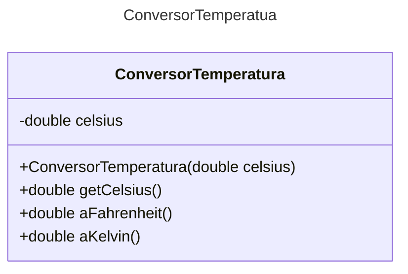

# Proyecto - Introducción a las pruebas automatizadas con Classroom50

## Propósito
Familiarizar al estudiante con el entorno de trabajo de Classroom50 y con el uso de pruebas automatizadas para verificar el comportamiento de un programa. Mediante la implementación de una clase sencilla, el estudiante observará cómo una prueba compara los resultados esperados con los resultados obtenidos, identificará errores en su código y realizará las correcciones necesarias hasta lograr que las pruebas sean exitosas.

## Diagrama de clases
[Editor en línea](https://mermaid.live/)

[Referencia-Mermaid](https://mermaid.js.org/syntax/classDiagram.html)

## Conversión de temperaturas
La clase recibe una temperatura en grados Celsius y calcula las demás escalas a partir de ese valor.

- **Celsius a Fahrenheit:** se multiplica Celsius por 9, se divide entre 5 y se suman 32.
    `Fahrenheit = (Celsius * 9 / 5) + 32`
- **Celsius a Kelvin:** se suman 273.15 a los grados Celsius.
    `Kelvin = Celsius + 273.15`

Por ejemplo, 25 °C equivalen a 77 °F y 298.15 K.

## Diagrama de clases UML con draw.io
El repositorio está configurado para crear Diagramas de clases UML con ```draw.io```. Para usarlo simplemente agrega un archivo con extensión ```.drawio.png```, das doble clic sobre el mismo y se activará el editor ```draw.io``` incrustado en ```VSCode``` para edición. Asegúrate de agregar las formas UML en el menú de formas del lado izquierdo (opción ```+Más formas```).

## Uso del proyecto con make

### Default - Compilar+Probar+Ejecutar
```
make
```
### Compilar
```
make compile
```
### Probar todo
```
make test
```
### Ejecutar App
```
make run
```
### Limpiar binarios
```
make clean
```
## Comandos Git-Cambios y envío a Autograding

### Por cada cambio importante que haga, actualice su historia usando los comandos:
```
git add .
git commit -m "Descripción del cambio"
```
### Envíe sus actualizaciones a GitHub para Autograding con el comando:
```
git push origin main
```
## Comandos individuales
### Compilar

```
find ./ -type f -name "*.java" > compfiles.txt
javac -d build -cp lib/junit-platform-console-standalone-1.5.2.jar @compfiles.txt
```
Ejecutar ambos comandos en 1 sólo paso:

```
find ./ -type f -name "*.java" > compfiles.txt ; javac -d build -cp lib/junit-platform-console-standalone-1.5.2.jar @compfiles.txt
```


### Ejecutar Todas la pruebas locales de 1 Test Case

```
java -jar lib/junit-platform-console-standalone-1.5.2.jar -class-path build --select-class miTest.AppTest
```
### Ejecutar 1 prueba local de 1 Test Case

```
java -jar lib/junit-platform-console-standalone-1.5.2.jar -class-path build --select-method miTest.AppTest#appHasAGreeting
```
### Ejecutar App
```
java -cp build miPrincipal.Principal
```
Los comandos anteriores están considerados para un ambiente Linux. [Referencia.](https://www.baeldung.com/junit-run-from-command-line)
